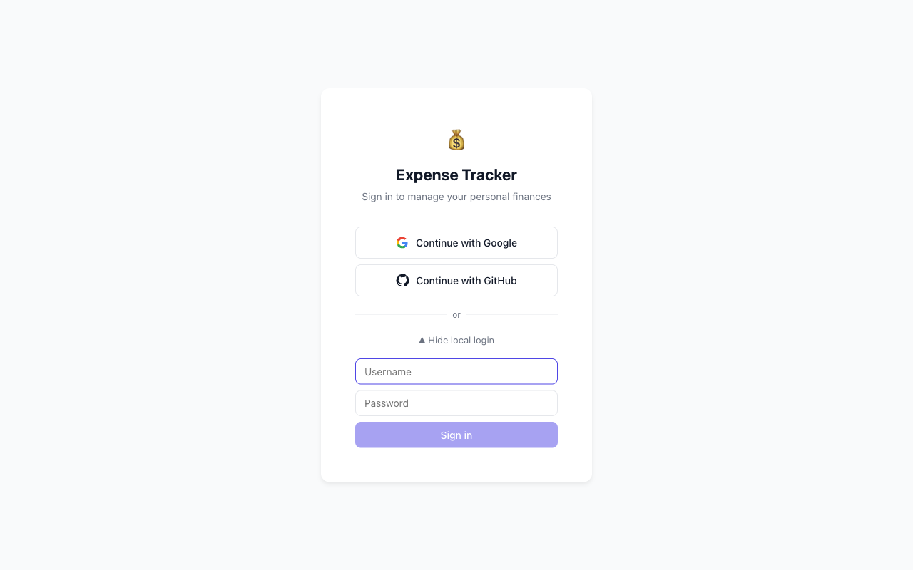
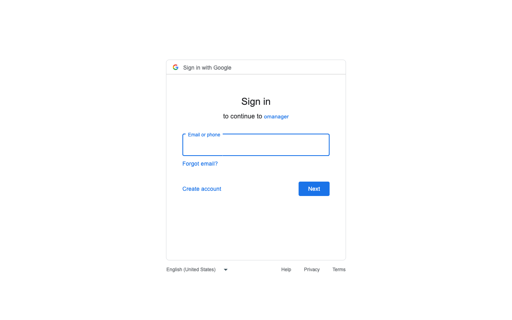
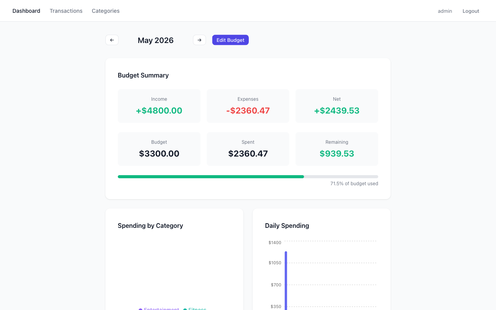
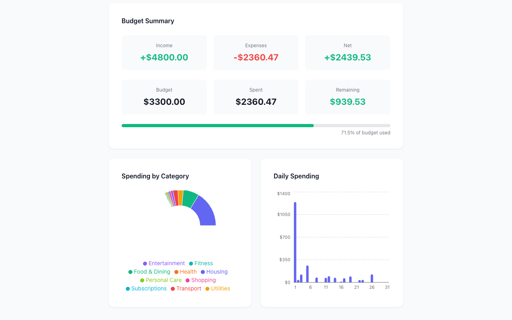
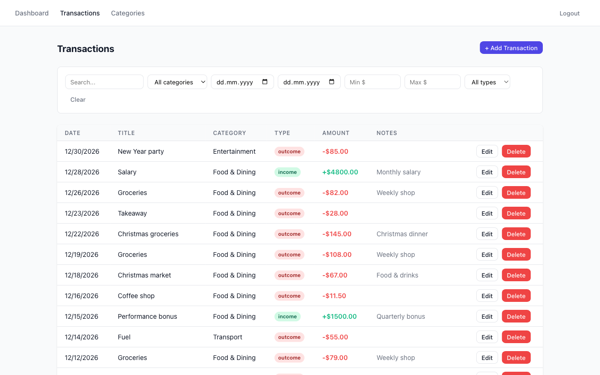
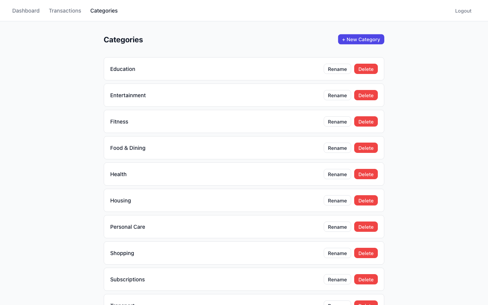

# Personal Expense Tracker

Full-stack expense tracker with Google/GitHub OAuth, real-time budget alerts via WebSocket.

**Stack:** Node.js · Express · SQLite (better-sqlite3) · React (Vite) · Styled Components

---

## Screenshots

| Login | Google OAuth |
|-------|--------------|
|  |  |

| Dashboard | Charts |
|-----------|--------|
|  |  |

| Transactions | Categories |
|--------------|------------|
|  |  |

> Run `make screenshots` to regenerate (starts the dev servers, seeds data, captures with Puppeteer).
> `google_oauth.png` is only captured when `GOOGLE_CLIENT_ID` is set in `backend/.env`.

---

## Setup

### Docker (recommended)

```bash
make prod-build   # build images and start — app available at http://localhost
make prod-down    # stop and remove containers
```

SQLite data is persisted in a Docker named volume (`db_data`). Override secrets by creating a `.env` file in the repo root before running (see [Environment Variables](#environment-variables-backendenv) below).

### Local dev (Makefile)

```bash
make deps       # npm install for both backend and frontend
make migrate    # run pending DB migrations
make seed       # seed demo data + create local admin user
make local      # start backend (port 3001) + frontend (port 5173) in parallel
```

Or start servers individually in separate terminals:

```bash
make dev-be     # backend dev server on http://localhost:3001
make dev-fe     # frontend dev server on http://localhost:5173
```

### Manual setup

**Backend:**
```bash
cd backend
npm install
cp .env.example .env
# Fill in credentials — see Environment Variables below
npm run dev
```

**Frontend:**
```bash
cd frontend
npm install
npm run dev
```

### Local login (no OAuth needed)

Add to `backend/.env`:
```env
LOCAL_AUTH_ENABLED=true
LOCAL_USERS=admin:password
```

Run `make seed` once to pre-create the admin row in the database. The login page will show a "Use local credentials" toggle automatically.

---

## Docker

### Architecture

```
Browser → nginx (:80)
            ├── /api/*   → backend:3001
            ├── /auth/*  → backend:3001
            ├── WS upgrade → backend:3001
            └── everything else → React SPA (static files)
```

`nginx` handles TLS termination, static file serving, and proxies all API/WebSocket traffic to the Node backend. The frontend is built with `VITE_API_URL=""` so all fetch calls use relative paths through nginx — no CORS involved.

### Make commands

| Command | Description |
|---------|-------------|
| `make prod-build` | Build images and start all services in the background |
| `make prod` | Start existing images (no rebuild) |
| `make prod-down` | Stop and remove containers |
| `make seed-prod` | Seed demo data inside the running Docker backend container |

### Configuration

Create a `.env` file in the repo root to override defaults:

```env
SESSION_SECRET=your_long_random_secret
FRONTEND_URL=https://your-domain.com
LOCAL_AUTH_ENABLED=true
LOCAL_USERS=admin:password
```

For OAuth in production, add the Google/GitHub credentials and set the callback URLs to your deployed domain (e.g. `https://your-domain.com/auth/google/callback`).

---

## Environment Variables (backend/.env)

| Variable | Description |
|----------|-------------|
| `PORT` | Server port (default: 3001) |
| `SESSION_SECRET` | Session signing secret |
| `GOOGLE_CLIENT_ID` | Google OAuth client ID |
| `GOOGLE_CLIENT_SECRET` | Google OAuth client secret |
| `GITHUB_CLIENT_ID` | GitHub OAuth client ID |
| `GITHUB_CLIENT_SECRET` | GitHub OAuth client secret |
| `FRONTEND_URL` | Frontend origin for CORS (default: http://localhost:5173) |
| `DB_PATH` | SQLite database file path (default: ./data/expense_tracker.db) |
| `LOCAL_AUTH_ENABLED` | Set to `true` to enable hardcoded local login (dev/testing only) |
| `LOCAL_USERS` | Comma-separated `username:password` pairs for local auth |

---

## OAuth Configuration

OAuth providers are optional — the app only registers a strategy if the corresponding env vars are present. You can run with just one provider, both, or neither (using local auth instead).

### Google

1. Open [Google Cloud Console → Credentials](https://console.cloud.google.com/apis/credentials)
2. Click **Create Credentials → OAuth 2.0 Client ID**
3. Set **Application type** to **Web application**
4. Under **Authorized redirect URIs** add:
   ```
   http://localhost:3001/auth/google/callback
   ```
5. Click **Create** — copy the **Client ID** and **Client Secret**
6. Add to `backend/.env`:
   ```env
   GOOGLE_CLIENT_ID=your_client_id
   GOOGLE_CLIENT_SECRET=your_client_secret
   ```

> **Scopes requested:** `profile`, `email` — the app stores display name, email, and avatar URL.

#### Production
Change the redirect URI to match your deployed backend:
```
https://your-backend.example.com/auth/google/callback
```
Set `BACKEND_URL=https://your-backend.example.com` and `FRONTEND_URL=https://your-app.example.com` in the environment.

---

### GitHub

1. Open [GitHub → Settings → Developer settings → OAuth Apps → New OAuth App](https://github.com/settings/applications/new)
2. Fill in:
   - **Application name** — anything (e.g. `Expense Tracker Dev`)
   - **Homepage URL** — `http://localhost:5173`
   - **Authorization callback URL** — `http://localhost:3001/auth/github/callback`
3. Click **Register application** — then **Generate a new client secret**
4. Add to `backend/.env`:
   ```env
   GITHUB_CLIENT_ID=your_client_id
   GITHUB_CLIENT_SECRET=your_client_secret
   ```

> **Scopes requested:** `user:email` — the app stores display name, email, and avatar URL.

#### Production
Update the **Authorization callback URL** in the GitHub app settings to:
```
https://your-backend.example.com/auth/github/callback
```

---

### How the OAuth flow works

```
Browser → GET /auth/google (or /auth/github)
       ← redirect to provider login
Provider → GET /auth/google/callback?code=...
         ← upsert user in DB, set session cookie
         ← redirect to FRONTEND_URL (/)
```

On success the user is redirected to the frontend root. On failure they are redirected to `/login`. The session cookie is `httpOnly`, `sameSite: lax`, and expires after 7 days.

---

## API Overview

| Method | Path | Auth | Description |
|--------|------|------|-------------|
| GET | /auth/google | No | Start Google OAuth flow |
| GET | /auth/github | No | Start GitHub OAuth flow |
| GET | /auth/local/enabled | No | Check if local auth is enabled |
| POST | /auth/local | No | Sign in with local credentials |
| POST | /auth/logout | No | Destroy session |
| GET | /auth/me | Yes | Current user |
| GET | /api/categories | Yes | List categories |
| POST | /api/categories | Yes | Create category |
| PATCH | /api/categories/:id | Yes | Rename category |
| DELETE | /api/categories/:id | Yes | Delete category |
| GET | /api/transactions | Yes | List transactions (filterable) |
| POST | /api/transactions | Yes | Create transaction |
| PATCH | /api/transactions/:id | Yes | Update transaction |
| DELETE | /api/transactions/:id | Yes | Delete transaction |
| GET | /api/budget/:year/:month | Yes | Get budget summary |
| PUT | /api/budget/:year/:month | Yes | Set/update budget |

### Transaction filters (query params)
- `search` — title or notes contains string
- `category_id` — filter by category
- `date_from` / `date_to` — ISO date range (YYYY-MM-DD)
- `amount_min` / `amount_max` — amount range
- `type` — `outcome` or `income`

---

## WebSocket

Connect to `ws://localhost:3001` (local dev) or `ws://your-host` (Docker/nginx) after authentication.

**Client → Server:**
```json
{ "type": "subscribe" }
```

**Server → Client (budget alert):**
```json
{ "type": "alert", "threshold": 80, "usagePct": 83.2, "spent": 416.00, "budget": 500.00 }
```

Alerts fire at 50%, 80%, and 100% of monthly budget. Each threshold fires at most once per user per month.

The WebSocket connection is authenticated by reading the express-session cookie from the HTTP upgrade request. The client must be logged in before connecting. Alerts are only sent to the specific user whose budget was exceeded (not broadcast globally).

---

## Budget Alert Logic

Alerts are checked after every transaction create, update, or delete for the affected user and month. Only `outcome` transactions count toward the budget; `income` transactions are excluded.

**Thresholds:** 50%, 80%, 100% of the monthly budget.

**Deduplication:** each fired threshold is recorded in the `budget_alerts` table with `INSERT OR IGNORE`. An alert is only broadcast if the row was newly inserted (`db.changes > 0`), so each threshold fires at most once per user per month even if many transactions are added.

**No budget set:** if there is no row in `monthly_budgets` for that user/year/month, no alerts are checked.

**Payload fields:**

| Field | Type | Description |
|-------|------|-------------|
| `type` | `"alert"` | Message type |
| `threshold` | `50 \| 80 \| 100` | The threshold that was crossed |
| `usagePct` | number | Actual usage percentage (1 decimal place) |
| `spent` | number | Total amount spent this month |
| `budget` | number | Monthly budget amount |

---

## Local Auth (Development Only)

For local development without OAuth credentials, enable hardcoded users via env vars:

```env
LOCAL_AUTH_ENABLED=true
LOCAL_USERS=admin:password,tester:test456
```

- `LOCAL_AUTH_ENABLED=true` — enables the `/auth/local` login endpoint and shows the local login form in the UI
- `LOCAL_USERS` — comma-separated `username:password` pairs; colons in passwords are not supported

The default seed (`make seed`) pre-creates an `admin` user in the database. The login form appears automatically on the `/login` page when `LOCAL_AUTH_ENABLED=true`.

**Never enable this in production.**

---

## Category Deletion Policy

A category cannot be deleted if it has associated transactions. The API returns `409 Conflict`. To delete the category, first reassign or delete its transactions.

---

## Tests

```bash
make test                            # run all backend tests
```

Or run a single test file:
```bash
cd backend && npx jest src/__tests__/categories.test.ts
```

Frontend typecheck (no emit):
```bash
cd frontend && npm run typecheck
```

**Test coverage:**

| File | What it tests |
|------|---------------|
| `auth.test.ts` | `/auth/me`, `/auth/logout`, session handling |
| `categories.test.ts` | Category CRUD, rename, delete with transactions check |
| `transactions.test.ts` | Transaction CRUD, all query filters (search, category, date range, amount range) |
| `budget.test.ts` | Budget get/set, monthly summary math, alert threshold logic |
| `websocket.test.ts` | WebSocket authentication, subscribe message, alert broadcast and deduplication |

Tests use an in-memory SQLite database and bypass Passport entirely — no network calls required.
