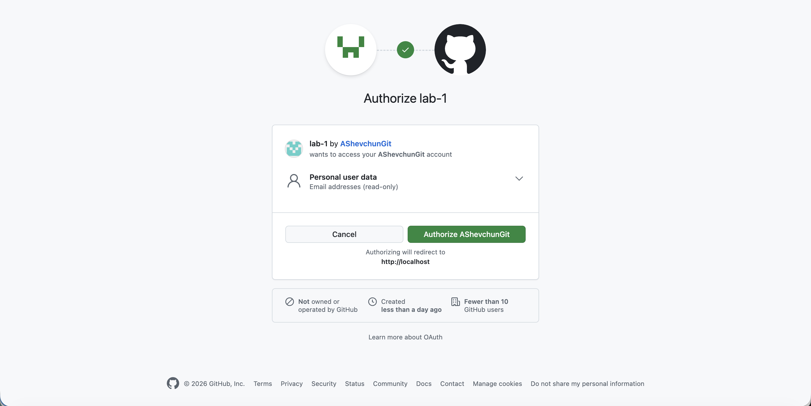

# Personal Expense Tracker 

**Tech Spec & Task Breakdown** 

**Stack:** Node.js · React · Styled Components · SQLite

| GitHub OAuth | GitHub Consent |
|--------------|----------------|
|  |  |

---

 

## 0. Architecture Overview

 

### Frontend

- React (Vite)

- Styled Components for styling

- Fetch API for HTTP

- Native WebSocket

 

### Backend

- Node.js

- Express (REST API)

- SQLite (via better-sqlite3 or sqlite3)

- OAuth (Google + GitHub)

- WebSocket (ws)

 

### General Conventions

- Frontend and backend as separate apps

- REST for CRUD, WebSocket for alerts

- Authentication required for all protected routes

 

---

 

## 1. Project Setup

 

### Backend

- Initialize Node.js project

- Configure Express server

- Setup SQLite connection

- Add environment variable support

- Configure basic logging

- Add error-handling middleware

 

### Frontend

- Initialize React (Vite)

- Add Styled Components

- Setup routing

- Setup global theme & layout

- Configure API base URL

 

---

 

## 2. Authentication (SSO Only)

 

### Backend Tasks

- Create `users` table

- Configure Google OAuth

- Configure GitHub OAuth

- Implement OAuth callback endpoints

- Create user on first login

- Persist user session (cookie-based)

- Implement logout endpoint

- Add auth middleware

- Protect API routes

- Authenticate WebSocket connections

 

### Frontend Tasks

- Create login page

- Add Google login button

- Add GitHub login button

- Handle OAuth redirect callback

- Persist login state on refresh

- Add logout action

 

---

 

## 3. Database Schema

 

### Tables

- `users`

- `categories`

- `transactions`

- `monthly_budgets`

- `budget_alerts`

 

### Data Tasks

- Write schema migration

- Add indexes for user_id

- Enforce category uniqueness per user

- Ensure foreign key constraints

 

---

 

## 4. Categories

 

### Backend

- Create category

- Rename category

- Delete category

- Enforce per-user ownership

- Implement deletion strategy:

  - Block deletion if transactions exist **or**

  - Reassign to `Uncategorized`

 

### Frontend

- Categories list UI

- Create category modal

- Rename category UI

- Delete category UI

- Empty state for no categories

 

---

 

## 5. Transactions

 

### Backend

- Create transaction endpoint

- Update transaction endpoint

- Delete transaction endpoint

- Validate:

  - title not empty

  - amount > 0

  - valid date

- Enforce per-user access

- Link transaction to category

 

### Frontend

- Transactions list/table

- Create transaction modal

- Edit transaction modal

- Delete confirmation dialog

- Client-side validation

- Loading and empty states

 

---

 

## 6. Monthly Budget

 

### Backend

- Create/update monthly budget

- Fetch budget summary for month

- Calculate:

  - total spent

  - remaining budget

  - usage percentage

- Handle “no budget set” case

 

### Frontend

- Month selector

- Budget summary dashboard

- Set/edit budget modal

- Clear “no budget set” state

 

---

 

## 7. Search & Filters

 

### Backend

- Search by title and notes

- Filter by category

- Filter by date range

- Filter by amount min/max

- Ensure filters are user-scoped

 

### Frontend

- Search input field

- Category filter dropdown

- Date range selector

- Amount range inputs

- Clear filters button

 

---

 

## 8. WebSocket Budget Alerts

 

### Backend

- Initialize WebSocket server

- Authenticate connections

- Implement client `subscribe` message

- Calculate monthly budget usage

- Fire alerts at:

  - 50%

  - 80%

  - 100%

- Ensure alerts fire once per threshold per month

- Trigger alerts on:

  - WebSocket connect

  - Transaction create/update/delete

- Persist fired alerts

 

### Frontend

- Open WebSocket after login

- Send `subscribe` event

- Receive alert messages

- Display alerts (toast/banner)

- Optional: send `ack` message

 

---

 

## 9. UI & UX Enhancements

 

- Responsive layout

- Table → card view for mobile

- Styled Components theme

- Hover & focus states

- Validation messages

- Loading indicators

- Error banners/snackbars

- Light theme only

 

---

 

## 10. Authorization & Security

 

- Verify user ownership on all endpoints

- Prevent cross-user data access

- Secure WebSocket events

- Sanitize inputs

- Hide internal server errors

 

---

 

## 11. Testing

 

### Backend Tests

- Mock Google OAuth login

- Mock GitHub OAuth login

- Create category test

- Create transaction test

- Cross-user access rejection

- WebSocket budget alert tests (50/80/100%)

 

### Frontend Tests (Optional)

- Login flow

- Transaction form validation

- Budget summary rendering

 

---

 

## 12. Documentation

 

- README setup instructions

- Environment variables list

- OAuth configuration steps

- API overview

- WebSocket message formats

- Budget alert logic

- Category deletion policy

- Test commands

 

---

 

## 13. Optional Enhancements

 

- Dockerfile

- docker-compose

- Seed/demo data

- Charts for spending overview